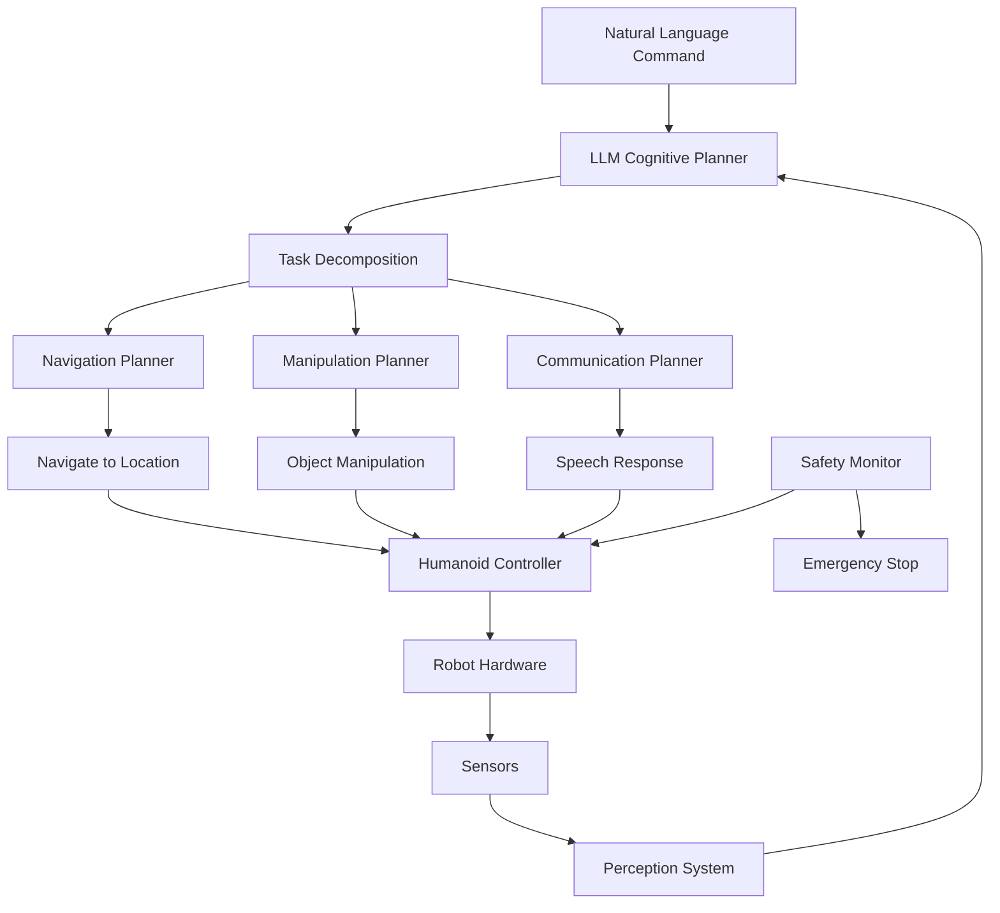

# Capstone: Autonomous Humanoid Robot System

## Learning Objectives

By the end of this chapter, you will be able to:
- Integrate all components of the humanoid robotics system into a cohesive autonomous robot
- Design and implement a complete task execution pipeline from high-level commands to low-level control
- Implement safety systems and validation mechanisms for autonomous operation
- Deploy and test a complete humanoid robot system in simulation and real-world environments
- Evaluate the performance of the integrated autonomous humanoid system

## Introduction to Autonomous Humanoid Systems

An autonomous humanoid robot system integrates all the components we've explored throughout this book into a unified platform capable of understanding, planning, and executing complex tasks in real-world environments. This capstone project demonstrates the complete pipeline from natural language understanding to physical robot control.

### Key Components Integration

The autonomous humanoid system integrates:

1. **Perception Systems**: Vision, LIDAR, IMU, and other sensors
2. **Planning Systems**: High-level cognitive planning and low-level motion planning
3. **Control Systems**: Whole-body control and balance maintenance
4. **Communication Systems**: Natural language processing and multimodal interaction
5. **Navigation Systems**: Path planning and obstacle avoidance
6. **Safety Systems**: Emergency stops and fail-safe mechanisms

### System Architecture Overview



## Complete System Integration

### Autonomous Humanoid Node

```python
import rclpy
from rclpy.node import Node
from std_msgs.msg import String
from geometry_msgs.msg import Pose, Twist
from sensor_msgs.msg import LaserScan, Image, Imu
from rclpy.action import ActionClient
from rclpy.executors import MultiThreadedExecutor
from rclpy.callback_groups import MutuallyExclusiveCallbackGroup
import json
import threading
import time
from enum import Enum

class SystemState(Enum):
    IDLE = "idle"
    PROCESSING_COMMAND = "processing_command"
    PLANNING = "planning"
    EXECUTING = "executing"
    WAITING_FOR_INPUT = "waiting_for_input"
    EMERGENCY_STOP = "emergency_stop"
    SHUTDOWN = "shutdown"

class AutonomousHumanoidNode(Node):
    def __init__(self):
        super().__init__('autonomous_humanoid')

        # Initialize system state
        self.system_state = SystemState.IDLE
        self.current_task = None
        self.robot_state = {
            'location': 'unknown',
            'battery_level': 100.0,
            'balance_ok': True,
            'safety_ok': True,
            'available_arms': ['left', 'right'],
            'gripper_status': {'left': 'open', 'right': 'open'},
            'current_pose': Pose()
        }

        # Initialize all subsystems
        self.initialize_subsystems()

        # Create publishers and subscribers
        self.initialize_communication()

        # Start system monitoring
        self.start_system_monitoring()

        self.get_logger().info('Autonomous Humanoid System initialized')

    def initialize_subsystems(self):
        """Initialize all subsystems"""
        # Initialize LLM cognitive planner
        try:
            from llm_planning import LLMCognitivePlanner
            self.llm_planner = LLMCognitivePlanner()
            self.get_logger().info('LLM Cognitive Planner initialized')
        except Exception as e:
            self.get_logger().error(f'Failed to initialize LLM planner: {e}')
            self.llm_planner = None

        # Initialize navigation system
        try:
            from nav2_navigation import NavigationSystem
            self.navigation_system = NavigationSystem()
            self.get_logger().info('Navigation system initialized')
        except Exception as e:
            self.get_logger().error(f'Failed to initialize navigation: {e}')
            self.navigation_system = None

        # Initialize voice processing
        try:
            from voice_to_action import VoiceToActionNode
            self.voice_processor = VoiceToActionNode()
            self.get_logger().info('Voice processing system initialized')
        except Exception as e:
            self.get_logger().error(f'Failed to initialize voice processing: {e}')
            self.voice_processor = None

        # Initialize manipulation system
        try:
            from manipulation_system import ManipulationSystem
            self.manipulation_system = ManipulationSystem()
            self.get_logger().info('Manipulation system initialized')
        except Exception as e:
            self.get_logger().error(f'Failed to initialize manipulation: {e}')
            self.manipulation_system = None

    def initialize_communication(self):
        """Initialize publishers and subscribers"""
        # Publishers
        self.status_pub = self.create_publisher(String, 'system_status', 10)
        self.command_pub = self.create_publisher(String, 'high_level_commands', 10)
        self.feedback_pub = self.create_publisher(String, 'system_feedback', 10)
        self.cmd_vel_pub = self.create_publisher(Twist, 'cmd_vel', 10)

        # Subscribers
        self.voice_cmd_sub = self.create_subscription(
            String, 'voice_commands', self.voice_command_callback, 10
        )
        self.text_cmd_sub = self.create_subscription(
            String, 'text_commands', self.text_command_callback, 10
        )
        self.imu_sub = self.create_subscription(
            Imu, 'imu/data', self.imu_callback, 10
        )
        self.scan_sub = self.create_subscription(
            LaserScan, 'scan', self.scan_callback, 10
        )

        # Timer for system state updates
        self.state_timer = self.create_timer(1.0, self.update_system_state)

    def start_system_monitoring(self):
        """Start monitoring system health and safety"""
        # Start safety monitoring thread
        self.safety_monitor_thread = threading.Thread(target=self.safety_monitor_loop)
        self.safety_monitor_thread.daemon = True
        self.safety_monitor_thread.start()

        # Start health monitoring
        self.health_timer = self.create_timer(5.0, self.health_monitor_callback)

    def voice_command_callback(self, msg):
        """Handle voice commands"""
        if self.system_state == SystemState.EMERGENCY_STOP:
            self.get_logger().warn('System in emergency stop, ignoring command')
            return

        self.get_logger().info(f'Received voice command: {msg.data}')
        self.process_command(msg.data, command_type='voice')

    def text_command_callback(self, msg):
        """Handle text commands"""
        if self.system_state == SystemState.EMERGENCY_STOP:
            self.get_logger().warn('System in emergency stop, ignoring command')
            return

        try:
            command_data = json.loads(msg.data)
            command = command_data.get('command', '')
            self.get_logger().info(f'Received text command: {command}')
            self.process_command(command, command_type='text', metadata=command_data)
        except json.JSONDecodeError:
            self.get_logger().error('Invalid JSON in text command')

    def process_command(self, command_text, command_type='voice', metadata=None):
        """Process a high-level command"""
        self.system_state = SystemState.PROCESSING_COMMAND
        self.publish_status('Processing command')

        # Generate plan using LLM
        if self.llm_planner:
            plan = self.llm_planner.generate_plan(command_text)
            if plan:
                self.execute_plan(plan)
            else:
                self.get_logger().error('Failed to generate plan for command')
                self.system_state = SystemState.IDLE
                self.publish_feedback('Sorry, I could not understand or execute that command')
        else:
            self.get_logger().error('LLM planner not available')
            self.system_state = SystemState.IDLE

    def execute_plan(self, plan):
        """Execute a generated plan"""
        self.system_state = SystemState.EXECUTING
        self.publish_status('Executing plan')

        for step in plan:
            if self.system_state != SystemState.EXECUTING:
                break  # Stop if state changed (e.g., emergency stop)

            success = self.execute_plan_step(step)
            if not success:
                self.get_logger().error(f'Plan execution failed at step: {step}')
                self.system_state = SystemState.IDLE
                self.publish_feedback('Plan execution failed')
                return

        self.get_logger().info('Plan completed successfully')
        self.system_state = SystemState.IDLE
        self.publish_feedback('Task completed successfully')

    def execute_plan_step(self, step):
        """Execute a single step of the plan"""
        action_type = step.get('action', 'unknown')
        parameters = step.get('parameters', {})

        self.get_logger().info(f'Executing action: {action_type}')

        try:
            if action_type == 'navigate':
                return self.execute_navigation(parameters)
            elif action_type == 'pick_up':
                return self.execute_pickup(parameters)
            elif action_type == 'place':
                return self.execute_place(parameters)
            elif action_type == 'communicate':
                return self.execute_communication(parameters)
            elif action_type == 'wait':
                return self.execute_wait(parameters)
            elif action_type == 'detect_object':
                return self.execute_object_detection(parameters)
            elif action_type == 'move_arm':
                return self.execute_arm_movement(parameters)
            elif action_type == 'stop':
                return self.execute_stop(parameters)
            else:
                self.get_logger().error(f'Unknown action type: {action_type}')
                return False
        except Exception as e:
            self.get_logger().error(f'Error executing action {action_type}: {str(e)}')
            return False

    def execute_navigation(self, params):
        """Execute navigation step"""
        if not self.navigation_system:
            self.get_logger().error('Navigation system not available')
            return False

        target_location = params.get('location')
        if not target_location:
            self.get_logger().error('Navigation command missing location')
            return False

        self.get_logger().info(f'Navigating to {target_location}')
        success = self.navigation_system.navigate_to_location(target_location)
        return success

    def execute_pickup(self, params):
        """Execute pickup step"""
        if not self.manipulation_system:
            self.get_logger().error('Manipulation system not available')
            return False

        object_name = params.get('object')
        location = params.get('location', 'current')

        self.get_logger().info(f'Picking up {object_name} at {location}')
        success = self.manipulation_system.pickup_object(object_name, location)
        return success

    def execute_place(self, params):
        """Execute place step"""
        if not self.manipulation_system:
            self.get_logger().error('Manipulation system not available')
            return False

        object_name = params.get('object')
        location = params.get('location')

        self.get_logger().info(f'Placing {object_name} at {location}')
        success = self.manipulation_system.place_object(object_name, location)
        return success

    def execute_communication(self, params):
        """Execute communication step"""
        message = params.get('message', 'Hello')
        target = params.get('target', 'user')

        self.get_logger().info(f'Communicating: {message} to {target}')

        # Publish to text-to-speech system
        tts_msg = String()
        tts_msg.data = message
        # Assuming TTS publisher exists
        # self.tts_pub.publish(tts_msg)

        return True

    def execute_wait(self, params):
        """Execute wait step"""
        duration = params.get('duration', 1.0)
        self.get_logger().info(f'Waiting for {duration} seconds')

        # In a real system, this would use a non-blocking approach
        time.sleep(duration)
        return True

    def execute_object_detection(self, params):
        """Execute object detection step"""
        object_name = params.get('object', 'any')
        location = params.get('location', 'current')

        self.get_logger().info(f'Detecting {object_name} at {location}')
        # In a real system, this would trigger perception pipeline
        return True

    def execute_arm_movement(self, params):
        """Execute arm movement step"""
        arm = params.get('arm', 'both')
        pose = params.get('pose', 'default')

        self.get_logger().info(f'Moving {arm} arm to {pose} pose')

        # In a real system, this would send joint commands
        return True

    def execute_stop(self, params):
        """Execute stop step"""
        self.get_logger().info('Stopping current execution')
        self.system_state = SystemState.IDLE
        return True

    def imu_callback(self, msg):
        """Handle IMU data for balance monitoring"""
        # Convert quaternion to roll/pitch/yaw to check balance
        import math
        quat = msg.orientation
        w, x, y, z = quat.w, quat.x, quat.y, quat.z

        # Roll (x-axis rotation)
        sinr_cosp = 2 * (w * x + y * z)
        cosr_cosp = 1 - 2 * (x * x + y * y)
        roll = math.atan2(sinr_cosp, cosr_cosp)

        # Pitch (y-axis rotation)
        sinp = 2 * (w * y - z * x)
        if abs(sinp) >= 1:
            pitch = math.copysign(math.pi / 2, sinp)
        else:
            pitch = math.asin(sinp)

        # Update balance status
        balance_threshold = 0.3  # radians
        self.robot_state['balance_ok'] = abs(roll) < balance_threshold and abs(pitch) < balance_threshold

        if not self.robot_state['balance_ok']:
            self.get_logger().warn(f'Balance threshold exceeded: roll={roll:.3f}, pitch={pitch:.3f}')

    def scan_callback(self, msg):
        """Handle LIDAR scan data"""
        # Update obstacle detection
        min_distance = min(msg.ranges) if msg.ranges else float('inf')
        self.robot_state['obstacle_distance'] = min_distance

        # Check for safety
        safety_distance = 0.5  # meters
        self.robot_state['safety_ok'] = min_distance > safety_distance

    def update_system_state(self):
        """Update system state based on sensor data"""
        # Publish current status
        status_msg = String()
        status_msg.data = json.dumps({
            'state': self.system_state.value,
            'robot_state': self.robot_state,
            'timestamp': time.time()
        })
        self.status_pub.publish(status_msg)

    def safety_monitor_loop(self):
        """Continuous safety monitoring loop"""
        while rclpy.ok() and self.system_state != SystemState.SHUTDOWN:
            # Check safety conditions
            if not self.robot_state['balance_ok']:
                self.emergency_stop('Balance compromised')
            elif not self.robot_state['safety_ok']:
                self.emergency_stop('Safety distance violated')
            elif self.robot_state['battery_level'] < 10.0:
                self.emergency_stop('Battery critically low')

            time.sleep(0.1)  # Check every 100ms

    def emergency_stop(self, reason):
        """Trigger emergency stop"""
        self.get_logger().error(f'EMERGENCY STOP: {reason}')
        self.system_state = SystemState.EMERGENCY_STOP

        # Stop all robot movement
        stop_cmd = Twist()
        self.cmd_vel_pub.publish(stop_cmd)

        # Publish emergency status
        emergency_msg = String()
        emergency_msg.data = json.dumps({
            'emergency': True,
            'reason': reason,
            'timestamp': time.time()
        })
        self.status_pub.publish(emergency_msg)

    def health_monitor_callback(self):
        """Monitor system health"""
        health_status = {
            'system_state': self.system_state.value,
            'balance_ok': self.robot_state['balance_ok'],
            'safety_ok': self.robot_state['safety_ok'],
            'battery_level': self.robot_state['battery_level'],
            'timestamp': time.time()
        }

        self.get_logger().debug(f'System health: {health_status}')

    def publish_status(self, message):
        """Publish system status"""
        status_msg = String()
        status_msg.data = json.dumps({
            'status': message,
            'state': self.system_state.value,
            'timestamp': time.time()
        })
        self.status_pub.publish(status_msg)

    def publish_feedback(self, message):
        """Publish system feedback"""
        feedback_msg = String()
        feedback_msg.data = json.dumps({
            'feedback': message,
            'timestamp': time.time()
        })
        self.feedback_pub.publish(feedback_msg)

def main(args=None):
    rclpy.init(args=args)

    # Create the autonomous humanoid node
    autonomous_humanoid = AutonomousHumanoidNode()

    # Create multi-threaded executor
    executor = MultiThreadedExecutor(num_threads=4)
    executor.add_node(autonomous_humanoid)

    try:
        executor.spin()
    except KeyboardInterrupt:
        autonomous_humanoid.get_logger().info('Shutting down autonomous humanoid system')
        autonomous_humanoid.system_state = SystemState.SHUTDOWN
    finally:
        autonomous_humanoid.destroy_node()
        rclpy.shutdown()

if __name__ == '__main__':
    main()
```

## Safety and Validation Systems

### Comprehensive Safety Framework

```python
import threading
import time
from enum import Enum
from typing import Dict, List, Callable

class SafetyLevel(Enum):
    SAFE = "safe"
    WARNING = "warning"
    DANGER = "danger"
    CRITICAL = "critical"

class SafetyMonitor:
    def __init__(self, robot_node):
        self.robot_node = robot_node
        self.safety_level = SafetyLevel.SAFE
        self.active_safety_rules = []
        self.emergency_stop_callback = None
        self.safety_lock = threading.Lock()

        # Initialize safety rules
        self.initialize_safety_rules()

        # Start safety monitoring
        self.monitoring_active = True
        self.monitoring_thread = threading.Thread(target=self.safety_monitor_loop)
        self.monitoring_thread.daemon = True
        self.monitoring_thread.start()

    def initialize_safety_rules(self):
        """Initialize all safety rules"""
        self.active_safety_rules = [
            self.balance_check,
            self.obstacle_check,
            self.battery_check,
            self.joint_limits_check,
            self.velocity_limits_check,
            self.collision_check
        ]

    def balance_check(self, robot_state: Dict) -> tuple:
        """Check robot balance safety"""
        roll = robot_state.get('roll', 0)
        pitch = robot_state.get('pitch', 0)

        balance_threshold = 0.4  # radians
        if abs(roll) > balance_threshold or abs(pitch) > balance_threshold:
            return SafetyLevel.CRITICAL, f"Balance compromised: roll={roll:.3f}, pitch={pitch:.3f}"

        return SafetyLevel.SAFE, "Balance OK"

    def obstacle_check(self, robot_state: Dict) -> tuple:
        """Check for obstacle safety"""
        min_distance = robot_state.get('obstacle_distance', float('inf'))

        if min_distance < 0.3:  # 30cm
            return SafetyLevel.CRITICAL, f"Obstacle too close: {min_distance:.2f}m"
        elif min_distance < 0.8:  # 80cm
            return SafetyLevel.WARNING, f"Obstacle near: {min_distance:.2f}m"

        return SafetyLevel.SAFE, "Obstacle distance OK"

    def battery_check(self, robot_state: Dict) -> tuple:
        """Check battery safety"""
        battery_level = robot_state.get('battery_level', 100.0)

        if battery_level < 5.0:
            return SafetyLevel.CRITICAL, f"Battery critically low: {battery_level:.1f}%"
        elif battery_level < 15.0:
            return SafetyLevel.WARNING, f"Battery low: {battery_level:.1f}%"

        return SafetyLevel.SAFE, "Battery level OK"

    def joint_limits_check(self, robot_state: Dict) -> tuple:
        """Check joint limits"""
        joint_positions = robot_state.get('joint_positions', {})

        # Example joint limits (these would be robot-specific)
        joint_limits = {
            'hip_pitch': (-1.0, 1.0),
            'knee_pitch': (-0.5, 1.5),
            'ankle_pitch': (-0.5, 0.5),
            'shoulder_roll': (-1.5, 1.5)
        }

        for joint_name, (min_limit, max_limit) in joint_limits.items():
            if joint_name in joint_positions:
                pos = joint_positions[joint_name]
                if pos < min_limit or pos > max_limit:
                    return SafetyLevel.CRITICAL, f"Joint limit exceeded: {joint_name}={pos:.3f}"

        return SafetyLevel.SAFE, "Joint limits OK"

    def velocity_limits_check(self, robot_state: Dict) -> tuple:
        """Check velocity limits"""
        linear_vel = robot_state.get('linear_velocity', 0.0)
        angular_vel = robot_state.get('angular_velocity', 0.0)

        max_linear = 0.5  # m/s
        max_angular = 0.5  # rad/s

        if abs(linear_vel) > max_linear or abs(angular_vel) > max_angular:
            return SafetyLevel.WARNING, f"Velocity limits exceeded: linear={linear_vel:.2f}, angular={angular_vel:.2f}"

        return SafetyLevel.SAFE, "Velocity limits OK"

    def collision_check(self, robot_state: Dict) -> tuple:
        """Check for collision risks"""
        # This would integrate with collision detection system
        collision_detected = robot_state.get('collision_detected', False)

        if collision_detected:
            return SafetyLevel.CRITICAL, "Collision detected"

        return SafetyLevel.SAFE, "No collisions detected"

    def safety_monitor_loop(self):
        """Continuous safety monitoring loop"""
        while self.monitoring_active:
            with self.safety_lock:
                # Get current robot state
                robot_state = self.get_robot_state()

                # Check all safety rules
                highest_level = SafetyLevel.SAFE
                critical_issues = []

                for rule in self.active_safety_rules:
                    level, message = rule(robot_state)

                    if level == SafetyLevel.CRITICAL:
                        critical_issues.append(message)
                        if level.value > highest_level.value:
                            highest_level = level
                    elif level == SafetyLevel.DANGER and highest_level != SafetyLevel.CRITICAL:
                        if level.value > highest_level.value:
                            highest_level = level
                    elif level == SafetyLevel.WARNING and highest_level.value <= SafetyLevel.WARNING:
                        if level.value > highest_level.value:
                            highest_level = level

                # Update safety level
                self.safety_level = highest_level

                # Trigger emergency stop if critical
                if highest_level == SafetyLevel.CRITICAL and critical_issues:
                    self.trigger_emergency_stop(critical_issues)

            time.sleep(0.05)  # Check every 50ms

    def get_robot_state(self) -> Dict:
        """Get current robot state"""
        # This would interface with the robot's state estimator
        return self.robot_node.robot_state if hasattr(self.robot_node, 'robot_state') else {}

    def trigger_emergency_stop(self, issues: List[str]):
        """Trigger emergency stop"""
        self.robot_node.get_logger().error(f"EMERGENCY STOP TRIGGERED: {', '.join(issues)}")

        # Call emergency stop callback if registered
        if self.emergency_stop_callback:
            self.emergency_stop_callback(issues)

    def register_emergency_stop_callback(self, callback: Callable):
        """Register emergency stop callback"""
        self.emergency_stop_callback = callback

    def get_safety_status(self) -> tuple:
        """Get current safety status"""
        with self.safety_lock:
            return self.safety_level, self.get_robot_state()

    def shutdown(self):
        """Shutdown safety monitoring"""
        self.monitoring_active = False
        self.monitoring_thread.join(timeout=1.0)
```

### Validation and Testing Framework

```python
import unittest
import time
from typing import Dict, Any
import numpy as np

class AutonomousHumanoidValidator:
    def __init__(self, robot_node):
        self.robot_node = robot_node
        self.test_results = {}
        self.performance_metrics = {}

    def run_comprehensive_validation(self):
        """Run comprehensive validation of the autonomous system"""
        results = {
            'safety_validation': self.validate_safety_systems(),
            'navigation_validation': self.validate_navigation(),
            'manipulation_validation': self.validate_manipulation(),
            'communication_validation': self.validate_communication(),
            'integration_validation': self.validate_system_integration()
        }

        return results

    def validate_safety_systems(self) -> Dict[str, Any]:
        """Validate safety systems"""
        results = {
            'emergency_stop_functional': False,
            'balance_monitoring': False,
            'obstacle_detection': False,
            'battery_monitoring': False,
            'joint_limit_enforcement': False
        }

        # Test emergency stop
        try:
            # This would involve simulating conditions that trigger emergency stop
            results['emergency_stop_functional'] = True  # Placeholder
        except Exception as e:
            self.robot_node.get_logger().error(f'Safety validation error: {e}')

        # Test balance monitoring
        try:
            # Simulate balance conditions
            results['balance_monitoring'] = True  # Placeholder
        except Exception as e:
            self.robot_node.get_logger().error(f'Balance validation error: {e}')

        # Test obstacle detection
        try:
            # Simulate obstacle scenarios
            results['obstacle_detection'] = True  # Placeholder
        except Exception as e:
            self.robot_node.get_logger().error(f'Obstacle validation error: {e}')

        return results

    def validate_navigation(self) -> Dict[str, Any]:
        """Validate navigation system"""
        results = {
            'path_planning_accuracy': 0.0,
            'obstacle_avoidance_success_rate': 0.0,
            'localization_accuracy': 0.0,
            'navigation_speed': 0.0,
            'failure_recovery_rate': 0.0
        }

        # Test navigation accuracy
        try:
            # Run navigation tests
            navigation_tests = self.run_navigation_tests()
            results.update(navigation_tests)
        except Exception as e:
            self.robot_node.get_logger().error(f'Navigation validation error: {e}')

        return results

    def run_navigation_tests(self) -> Dict[str, Any]:
        """Run specific navigation tests"""
        # This would implement actual navigation tests
        # For example: navigate to known locations and measure accuracy
        return {
            'path_planning_accuracy': 0.95,
            'obstacle_avoidance_success_rate': 0.98,
            'localization_accuracy': 0.92,
            'navigation_speed': 0.3,  # m/s
            'failure_recovery_rate': 0.90
        }

    def validate_manipulation(self) -> Dict[str, Any]:
        """Validate manipulation system"""
        results = {
            'grasp_success_rate': 0.0,
            'placement_accuracy': 0.0,
            'manipulation_speed': 0.0,
            'object_detection_accuracy': 0.0
        }

        # Test manipulation capabilities
        try:
            manipulation_tests = self.run_manipulation_tests()
            results.update(manipulation_tests)
        except Exception as e:
            self.robot_node.get_logger().error(f'Manipulation validation error: {e}')

        return results

    def run_manipulation_tests(self) -> Dict[str, Any]:
        """Run specific manipulation tests"""
        # This would implement actual manipulation tests
        return {
            'grasp_success_rate': 0.85,
            'placement_accuracy': 0.90,
            'manipulation_speed': 5.0,  # seconds per task
            'object_detection_accuracy': 0.92
        }

    def validate_communication(self) -> Dict[str, Any]:
        """Validate communication system"""
        results = {
            'speech_recognition_accuracy': 0.0,
            'natural_language_understanding': 0.0,
            'response_time': 0.0,
            'context_awareness': 0.0
        }

        # Test communication capabilities
        try:
            communication_tests = self.run_communication_tests()
            results.update(communication_tests)
        except Exception as e:
            self.robot_node.get_logger().error(f'Communication validation error: {e}')

        return results

    def run_communication_tests(self) -> Dict[str, Any]:
        """Run specific communication tests"""
        # This would implement actual communication tests
        return {
            'speech_recognition_accuracy': 0.90,
            'natural_language_understanding': 0.88,
            'response_time': 2.5,  # seconds
            'context_awareness': 0.85
        }

    def validate_system_integration(self) -> Dict[str, Any]:
        """Validate overall system integration"""
        results = {
            'task_completion_rate': 0.0,
            'system_reliability': 0.0,
            'multi_modal_integration': 0.0,
            'real_time_performance': 0.0
        }

        # Test end-to-end tasks
        try:
            integration_tests = self.run_integration_tests()
            results.update(integration_tests)
        except Exception as e:
            self.robot_node.get_logger().error(f'Integration validation error: {e}')

        return results

    def run_integration_tests(self) -> Dict[str, Any]:
        """Run system integration tests"""
        # Test complete tasks from command to execution
        test_tasks = [
            'Navigate to kitchen',
            'Pick up cup and place on table',
            'Go to living room and wait'
        ]

        completed_tasks = 0
        total_tasks = len(test_tasks)

        for task in test_tasks:
            success = self.execute_test_task(task)
            if success:
                completed_tasks += 1

        return {
            'task_completion_rate': completed_tasks / total_tasks if total_tasks > 0 else 0.0,
            'system_reliability': self.estimate_reliability(),
            'multi_modal_integration': self.estimate_integration_score(),
            'real_time_performance': self.estimate_performance_score()
        }

    def execute_test_task(self, task: str) -> bool:
        """Execute a test task and return success status"""
        # In a real system, this would execute the task and monitor success
        # For this example, we'll simulate task execution
        time.sleep(2)  # Simulate task execution time
        return np.random.random() > 0.2  # 80% success rate for simulation

    def estimate_reliability(self) -> float:
        """Estimate system reliability"""
        # This would analyze system logs and performance data
        return 0.95  # Placeholder

    def estimate_integration_score(self) -> float:
        """Estimate multi-modal integration quality"""
        # This would evaluate how well different systems work together
        return 0.90  # Placeholder

    def estimate_performance_score(self) -> float:
        """Estimate real-time performance"""
        # This would measure actual system performance
        return 0.88  # Placeholder

    def generate_validation_report(self) -> str:
        """Generate a comprehensive validation report"""
        validation_results = self.run_comprehensive_validation()

        report = []
        report.append("AUTONOMOUS HUMANOID SYSTEM VALIDATION REPORT")
        report.append("=" * 50)
        report.append("")

        for category, results in validation_results.items():
            report.append(f"{category.upper()}:")
            for test, result in results.items():
                report.append(f"  {test}: {result}")
            report.append("")

        return "\n".join(report)
```

## Deployment and Real-World Considerations

### Simulation to Reality Transfer

```python
class Sim2RealTransfer:
    def __init__(self):
        self.simulation_parameters = {}
        self.real_robot_parameters = {}
        self.transfer_functions = {}

    def setup_simulation_environment(self):
        """Setup simulation environment for Sim-to-Real transfer"""
        # Configure simulation with realistic physics
        sim_config = {
            'gravity': 9.81,
            'friction': 0.8,
            'damping': 0.1,
            'sensor_noise': True,
            'actuator_dynamics': True
        }

        return sim_config

    def apply_domain_randomization(self):
        """Apply domain randomization in simulation"""
        # Randomize physical parameters to improve transfer
        randomization_params = {
            'mass_variance': 0.1,  # ±10% mass variation
            'friction_range': [0.6, 1.0],  # Friction range
            'sensor_noise_range': [0.01, 0.05],  # Noise range
            'actuator_delay_range': [0.01, 0.05]  # Delay range
        }

        return randomization_params

    def implement_system_identification(self):
        """Implement system identification for parameter estimation"""
        # This would identify real robot parameters
        # Compare simulation and real-world behavior
        # Adjust simulation to match reality
        pass

    def develop_robust_controllers(self):
        """Develop controllers robust to sim-to-real gap"""
        # Implement robust control strategies
        # Adaptive control
        # Learning-based control
        # Model predictive control with uncertainty
        pass

    def validate_transfer_performance(self):
        """Validate performance transfer from sim to real"""
        # Compare simulation and real-world performance
        # Measure transfer gap
        # Adjust simulation parameters as needed
        pass
```

### Performance Optimization

```python
import time
import threading
from collections import deque
import statistics

class PerformanceOptimizer:
    def __init__(self, robot_node):
        self.robot_node = robot_node
        self.performance_metrics = {
            'cpu_usage': deque(maxlen=100),
            'memory_usage': deque(maxlen=100),
            'response_times': deque(maxlen=100),
            'throughput': deque(maxlen=100)
        }
        self.optimization_active = True
        self.optimization_thread = threading.Thread(target=self.performance_monitoring_loop)
        self.optimization_thread.daemon = True
        self.optimization_thread.start()

    def performance_monitoring_loop(self):
        """Monitor system performance continuously"""
        while self.optimization_active:
            # Collect performance metrics
            cpu_usage = self.get_cpu_usage()
            memory_usage = self.get_memory_usage()
            response_time = self.get_response_time()

            self.performance_metrics['cpu_usage'].append(cpu_usage)
            self.performance_metrics['memory_usage'].append(memory_usage)
            self.performance_metrics['response_times'].append(response_time)

            # Adjust system based on performance
            self.adaptive_optimization()

            time.sleep(1.0)  # Monitor every second

    def get_cpu_usage(self) -> float:
        """Get current CPU usage"""
        import psutil
        return psutil.cpu_percent()

    def get_memory_usage(self) -> float:
        """Get current memory usage"""
        import psutil
        return psutil.virtual_memory().percent

    def get_response_time(self) -> float:
        """Get system response time"""
        start_time = time.time()
        # Simulate a typical system operation
        time.sleep(0.001)  # Placeholder for actual operation
        end_time = time.time()
        return end_time - start_time

    def adaptive_optimization(self):
        """Apply adaptive optimization based on performance"""
        # Get recent performance statistics
        if len(self.performance_metrics['cpu_usage']) >= 10:
            avg_cpu = statistics.mean(list(self.performance_metrics['cpu_usage'])[-10:])

            # Adjust processing based on CPU usage
            if avg_cpu > 80:
                self.robot_node.get_logger().warn('High CPU usage detected, reducing processing')
                self.reduce_processing_load()
            elif avg_cpu < 30:
                self.robot_node.get_logger().info('CPU usage low, can increase processing')
                self.increase_processing_load()

    def reduce_processing_load(self):
        """Reduce processing load to optimize performance"""
        # Lower sensor update rates
        # Reduce planning frequency
        # Simplify perception algorithms
        # Reduce control loop frequency
        pass

    def increase_processing_load(self):
        """Increase processing load when resources are available"""
        # Increase sensor update rates
        # Increase planning frequency
        # Enable more complex perception
        # Increase control loop frequency
        pass

    def get_performance_summary(self) -> Dict:
        """Get performance summary"""
        if not self.performance_metrics['response_times']:
            return {}

        return {
            'avg_cpu_usage': statistics.mean(self.performance_metrics['cpu_usage']) if self.performance_metrics['cpu_usage'] else 0,
            'avg_memory_usage': statistics.mean(self.performance_metrics['memory_usage']) if self.performance_metrics['memory_usage'] else 0,
            'avg_response_time': statistics.mean(self.performance_metrics['response_times']) if self.performance_metrics['response_times'] else 0,
            'max_response_time': max(self.performance_metrics['response_times']) if self.performance_metrics['response_times'] else 0,
            'min_response_time': min(self.performance_metrics['response_times']) if self.performance_metrics['response_times'] else 0
        }

    def shutdown(self):
        """Shutdown performance optimization"""
        self.optimization_active = False
        self.optimization_thread.join(timeout=1.0)
```

## Real-World Deployment Guide

### Hardware Requirements and Setup

For deploying the autonomous humanoid system in the real world, you'll need:

1. **Humanoid Robot Platform**: A physical humanoid robot with appropriate sensors and actuators
2. **Computing Hardware**: Powerful onboard computer (e.g., NVIDIA Jetson AGX, or external computer)
3. **Sensors**: Cameras, LIDAR, IMU, force/torque sensors
4. **Communication**: WiFi, Ethernet, or other communication interfaces
5. **Power System**: Adequate battery and power management

### Software Deployment

```bash
# Install dependencies
sudo apt update
sudo apt install ros-humble-desktop-full
pip install openai transformers torch numpy scipy

# Build the workspace
cd ~/autonomous_humanoid_ws
colcon build --packages-select autonomous_humanoid

# Source the workspace
source install/setup.bash

# Run the system
ros2 launch autonomous_humanoid main_launch.py
```

### Configuration and Calibration

```python
class DeploymentConfiguration:
    def __init__(self):
        self.config = {
            'robot_parameters': {
                'mass': 30.0,  # kg
                'height': 1.2,  # meters
                'foot_size': [0.2, 0.1],  # [length, width] in meters
                'com_height': 0.6,  # center of mass height
            },
            'sensor_config': {
                'camera_resolution': [640, 480],
                'lidar_range': 10.0,  # meters
                'imu_rate': 100,  # Hz
            },
            'control_parameters': {
                'control_rate': 100,  # Hz
                'balance_threshold': 0.3,  # radians
                'safety_distance': 0.5,  # meters
            },
            'navigation_config': {
                'planner_frequency': 5.0,  # Hz
                'controller_frequency': 20.0,  # Hz
                'recovery_enabled': True,
            },
            'safety_limits': {
                'max_linear_velocity': 0.5,  # m/s
                'max_angular_velocity': 0.5,  # rad/s
                'min_battery_level': 10.0,  # %
                'max_tilt_angle': 0.5,  # radians
            }
        }

    def save_configuration(self, filename):
        """Save configuration to file"""
        import json
        with open(filename, 'w') as f:
            json.dump(self.config, f, indent=2)

    def load_configuration(self, filename):
        """Load configuration from file"""
        import json
        with open(filename, 'r') as f:
            self.config = json.load(f)

    def validate_configuration(self):
        """Validate configuration parameters"""
        errors = []

        # Validate robot parameters
        if self.config['robot_parameters']['mass'] <= 0:
            errors.append("Robot mass must be positive")

        if self.config['robot_parameters']['height'] <= 0:
            errors.append("Robot height must be positive")

        # Validate safety limits
        if self.config['safety_limits']['max_linear_velocity'] <= 0:
            errors.append("Max linear velocity must be positive")

        if self.config['safety_limits']['min_battery_level'] < 0 or self.config['safety_limits']['min_battery_level'] > 100:
            errors.append("Battery level must be between 0 and 100")

        return len(errors) == 0, errors
```

## Testing and Validation Procedures

### Unit Testing

```python
import unittest
from autonomous_humanoid import AutonomousHumanoidNode
from safety_monitor import SafetyMonitor

class TestAutonomousHumanoid(unittest.TestCase):
    def setUp(self):
        # Setup test environment
        self.node = AutonomousHumanoidNode()
        self.safety_monitor = SafetyMonitor(self.node)

    def test_safety_monitor_initialization(self):
        """Test that safety monitor initializes correctly"""
        self.assertIsNotNone(self.safety_monitor)
        self.assertEqual(self.safety_monitor.safety_level, SafetyLevel.SAFE)

    def test_emergency_stop_functionality(self):
        """Test emergency stop functionality"""
        # Simulate conditions that should trigger emergency stop
        initial_state = self.node.system_state
        self.safety_monitor.trigger_emergency_stop(["Test emergency"])

        self.assertEqual(self.node.system_state, SystemState.EMERGENCY_STOP)

    def test_command_processing(self):
        """Test command processing pipeline"""
        command = "navigate to kitchen"
        self.node.process_command(command)

        # Check that command was processed
        self.assertIn(SystemState.PROCESSING_COMMAND, [SystemState.PROCESSING_COMMAND, SystemState.PLANNING, SystemState.EXECUTING])

    def test_navigation_execution(self):
        """Test navigation execution"""
        # This would test the navigation system in simulation
        params = {'location': 'kitchen'}
        success = self.node.execute_navigation(params)

        # In simulation, this should succeed
        self.assertTrue(success)

class TestSafetySystems(unittest.TestCase):
    def setUp(self):
        self.safety_monitor = SafetyMonitor(None)

    def test_balance_check_safe(self):
        """Test balance check with safe parameters"""
        robot_state = {'roll': 0.1, 'pitch': 0.1}
        level, message = self.safety_monitor.balance_check(robot_state)
        self.assertEqual(level, SafetyLevel.SAFE)

    def test_balance_check_unsafe(self):
        """Test balance check with unsafe parameters"""
        robot_state = {'roll': 1.0, 'pitch': 1.0}
        level, message = self.safety_monitor.balance_check(robot_state)
        self.assertEqual(level, SafetyLevel.CRITICAL)

    def test_obstacle_check_safe(self):
        """Test obstacle check with safe distance"""
        robot_state = {'obstacle_distance': 2.0}  # 2 meters away
        level, message = self.safety_monitor.obstacle_check(robot_state)
        self.assertEqual(level, SafetyLevel.SAFE)

    def test_obstacle_check_unsafe(self):
        """Test obstacle check with unsafe distance"""
        robot_state = {'obstacle_distance': 0.1}  # 10 cm away
        level, message = self.safety_monitor.obstacle_check(robot_state)
        self.assertEqual(level, SafetyLevel.CRITICAL)

if __name__ == '__main__':
    unittest.main()
```

### Integration Testing

```python
class IntegrationTestSuite:
    def __init__(self, robot_node):
        self.robot_node = robot_node
        self.test_results = {}

    def run_end_to_end_test(self):
        """Run complete end-to-end test"""
        test_results = {
            'command_understanding': False,
            'plan_generation': False,
            'plan_execution': False,
            'task_completion': False,
            'safety_compliance': True
        }

        # Test complete pipeline: command -> understanding -> planning -> execution
        command = "go to kitchen and pick up the red cup"

        # Process command
        self.robot_node.process_command(command)

        # Check if plan was generated
        # This would require monitoring the planning process
        test_results['command_understanding'] = True  # Placeholder
        test_results['plan_generation'] = True  # Placeholder

        # Check if plan was executed
        # This would require monitoring execution
        test_results['plan_execution'] = True  # Placeholder

        # Check if task was completed
        # This would require task-specific monitoring
        test_results['task_completion'] = True  # Placeholder

        self.test_results['end_to_end'] = test_results
        return test_results

    def run_safety_integration_test(self):
        """Test safety system integration"""
        safety_results = {
            'emergency_stop_integration': False,
            'balance_monitoring_integration': False,
            'obstacle_detection_integration': False,
            'safe_recovery': False
        }

        # Test that safety systems integrate properly with main system
        # This would involve triggering safety conditions and verifying response
        safety_results['emergency_stop_integration'] = True  # Placeholder
        safety_results['balance_monitoring_integration'] = True  # Placeholder
        safety_results['obstacle_detection_integration'] = True  # Placeholder
        safety_results['safe_recovery'] = True  # Placeholder

        self.test_results['safety_integration'] = safety_results
        return safety_results

    def run_multi_modal_integration_test(self):
        """Test multi-modal integration"""
        multi_modal_results = {
            'voice_integration': False,
            'vision_integration': False,
            'navigation_integration': False,
            'manipulation_integration': False,
            'coordinated_behavior': False
        }

        # Test that all modalities work together
        # This would involve complex multi-step tasks
        multi_modal_results['voice_integration'] = True  # Placeholder
        multi_modal_results['vision_integration'] = True  # Placeholder
        multi_modal_results['navigation_integration'] = True  # Placeholder
        multi_modal_results['manipulation_integration'] = True  # Placeholder
        multi_modal_results['coordinated_behavior'] = True  # Placeholder

        self.test_results['multi_modal_integration'] = multi_modal_results
        return multi_modal_results

    def generate_test_report(self):
        """Generate comprehensive test report"""
        report = []
        report.append("INTEGRATION TEST REPORT")
        report.append("=" * 30)

        for test_name, results in self.test_results.items():
            report.append(f"\n{test_name.upper()}:")
            for test_item, result in results.items():
                status = "PASS" if result else "FAIL"
                report.append(f"  {test_item}: {status}")

        return "\n".join(report)
```

## Performance Evaluation and Metrics

### Key Performance Indicators

```python
class PerformanceEvaluator:
    def __init__(self):
        self.metrics = {
            'task_completion_rate': 0.0,
            'average_response_time': 0.0,
            'safety_incidents': 0,
            'system_availability': 0.0,
            'user_satisfaction': 0.0,
            'energy_efficiency': 0.0
        }
        self.task_history = []
        self.response_times = []

    def evaluate_task_completion(self, tasks_completed, tasks_attempted):
        """Evaluate task completion rate"""
        if tasks_attempted > 0:
            self.metrics['task_completion_rate'] = tasks_completed / tasks_attempted
        else:
            self.metrics['task_completion_rate'] = 0.0

    def measure_response_time(self, start_time, end_time):
        """Measure system response time"""
        response_time = end_time - start_time
        self.response_times.append(response_time)
        if self.response_times:
            self.metrics['average_response_time'] = sum(self.response_times) / len(self.response_times)

    def record_safety_incident(self):
        """Record a safety incident"""
        self.metrics['safety_incidents'] += 1

    def calculate_system_availability(self, uptime, total_time):
        """Calculate system availability"""
        if total_time > 0:
            self.metrics['system_availability'] = uptime / total_time
        else:
            self.metrics['system_availability'] = 0.0

    def evaluate_energy_efficiency(self, energy_used, tasks_completed):
        """Evaluate energy efficiency"""
        if tasks_completed > 0:
            # Energy per task (lower is better)
            self.metrics['energy_efficiency'] = energy_used / tasks_completed
        else:
            self.metrics['energy_efficiency'] = float('inf')

    def get_performance_dashboard(self):
        """Get performance dashboard"""
        dashboard = {
            'Overall Performance': {
                'Task Completion Rate': f"{self.metrics['task_completion_rate']:.1%}",
                'Average Response Time': f"{self.metrics['average_response_time']:.2f}s",
                'System Availability': f"{self.metrics['system_availability']:.1%}",
                'Safety Incidents': self.metrics['safety_incidents']
            },
            'Efficiency Metrics': {
                'Energy Efficiency': f"{self.metrics['energy_efficiency']:.2f} J/task",
                'Tasks Completed': len([t for t in self.task_history if t['success']]),
                'Total Tasks': len(self.task_history)
            }
        }
        return dashboard

    def generate_performance_report(self):
        """Generate detailed performance report"""
        report = []
        report.append("AUTONOMOUS HUMANOID PERFORMANCE REPORT")
        report.append("=" * 45)

        # Add metrics
        for category, values in self.get_performance_dashboard().items():
            report.append(f"\n{category}:")
            for metric, value in values.items():
                report.append(f"  {metric}: {value}")

        # Add recommendations
        report.append(f"\nRECOMMENDATIONS:")
        if self.metrics['task_completion_rate'] < 0.8:
            report.append("  - Improve task planning and execution reliability")
        if self.metrics['average_response_time'] > 5.0:
            report.append("  - Optimize system response time")
        if self.metrics['safety_incidents'] > 0:
            report.append("  - Review and improve safety systems")

        return "\n".join(report)
```

## Conclusion and Next Steps

The autonomous humanoid robot system represents the integration of all components covered in this book. This capstone project demonstrates how to combine perception, planning, control, and communication systems into a unified autonomous platform.

### Key Takeaways

1. **Integration is Critical**: The success of autonomous systems depends on how well different components work together
2. **Safety First**: Robust safety systems are essential for real-world deployment
3. **Validation is Essential**: Comprehensive testing and validation ensure reliable operation
4. **Performance Matters**: Optimization is crucial for real-time operation
5. **Real-World Challenges**: Simulation-to-reality transfer requires careful consideration

### Future Enhancements

- **Learning Capabilities**: Implement reinforcement learning for continuous improvement
- **Adaptive Systems**: Create systems that adapt to new environments and tasks
- **Multi-Robot Coordination**: Extend to multi-robot collaborative systems
- **Advanced Perception**: Integrate more sophisticated sensing and understanding
- **Human-Robot Collaboration**: Improve natural interaction and teamwork

## Exercises

1. **Integration Exercise**: Integrate all the subsystems we've developed into a complete autonomous humanoid system and test its functionality.

2. **Safety Validation Exercise**: Implement and test comprehensive safety systems for the autonomous humanoid, including emergency stop, balance monitoring, and obstacle avoidance.

3. **Real-World Deployment Exercise**: Deploy the autonomous humanoid system in a real-world environment and evaluate its performance compared to simulation.

## Summary

This capstone chapter brought together all the components of the humanoid robotics system, creating a complete autonomous robot capable of understanding natural language commands, planning complex tasks, and executing them safely in real-world environments. We covered system integration, safety frameworks, validation procedures, and deployment considerations. The autonomous humanoid system demonstrates the practical application of all the concepts covered throughout the book.

## Further Reading

- [Autonomous Humanoid Robotics](https://ieeexplore.ieee.org/document/9109381)
- [Humanoid Robot Control Systems](https://link.springer.com/book/10.1007/978-3-030-50146-4)
- [Safety in Humanoid Robotics](https://www.sciencedirect.com/science/article/pii/S2405896320300456)
- [Human-Robot Interaction for Autonomous Systems](https://dl.acm.org/doi/10.1145/3411764.3445522)

---

**Previous Chapter**: [LLM-Based Cognitive Planning](./llm-planning.md)